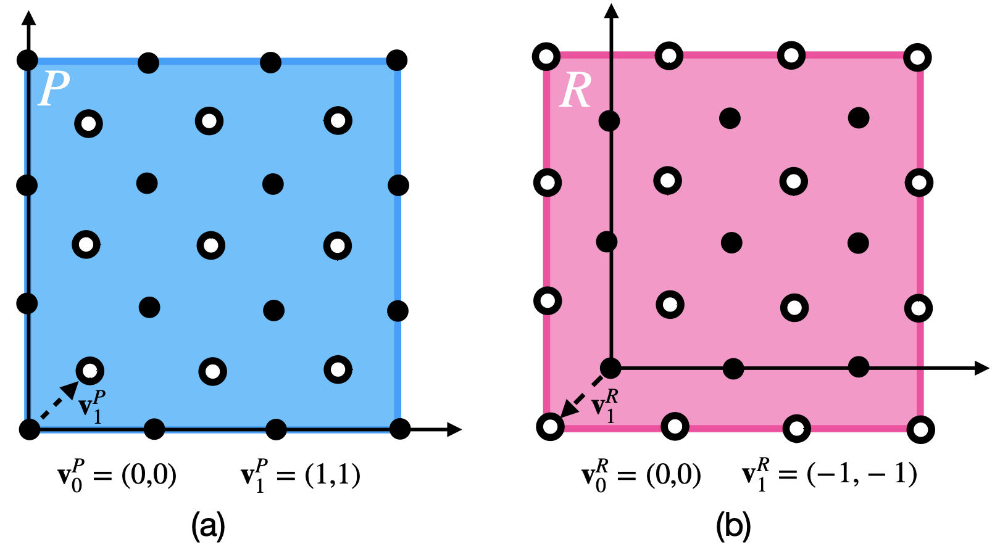

Lattice Tensors
================================
We've defined the lattice structures over which we want to operate,
but they currently don't hold any data. As we implied earlier, we
don't intend for you to explicitly create `LatticeTensors`;
most of the time you will want to use the `Lattice` instance as a
factory. For example:

.. code-block:: python

    from ncdl import Lattice
    import torch
    qc = Lattice("quincunx")
    lt = qc(
        torch.rand(1, 3, 4, 4),
        torch.rand(1, 3, 3, 3)
    )

Consistency
**************

Lattice tensors have a slight oddity about them. It's easiest to illustrate this with
a picture:

These two lattice tensors occupy different regions, but have the same
base geometry (so we should be able to add/subtract/perform arithmetic
on them; this is *compatability* and we talk about it in the paper).
In general it is possible for grids to interleave in many ways. This is an oddity
specific to lattice tensors that we must take care to implement.
If we don't allow this, the overall restricted grid structures we
can represent are limited, also padding becomes less robust
(we would be limited to certain types of padding).

.. code-block:: python

    from ncdl import Lattice
    import torch

    qc = Lattice("quincunx")

    lt = qc(
        {
            (0,0): torch.rand(1, 3, 3, 3),
            (-1,-1): torch.rand(1, 3, 4, 4)
        }
    )

Lattice Tensor Class
**********************
.. autosummary::
   :recursive:
   :toctree: _autosummary

   ncdl.LatticeTensor

.. rubric:: LatticeTensor Members

.. autosummary::
   :recursive:
   :toctree: _autosummary

    ncdl.LatticeTensor.coset
    ncdl.LatticeTensor.on_lattice
    ncdl.LatticeTensor.clone
    ncdl.LatticeTensor.detach
